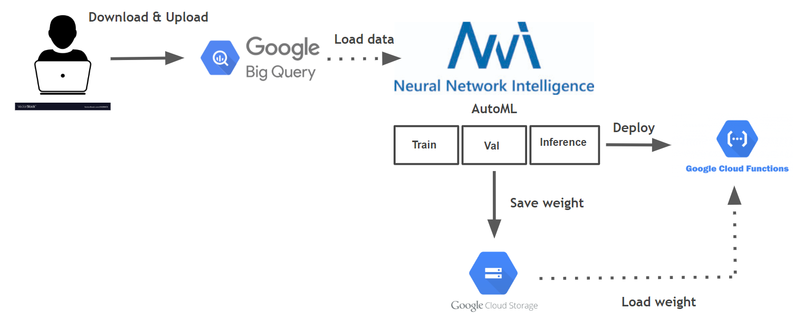
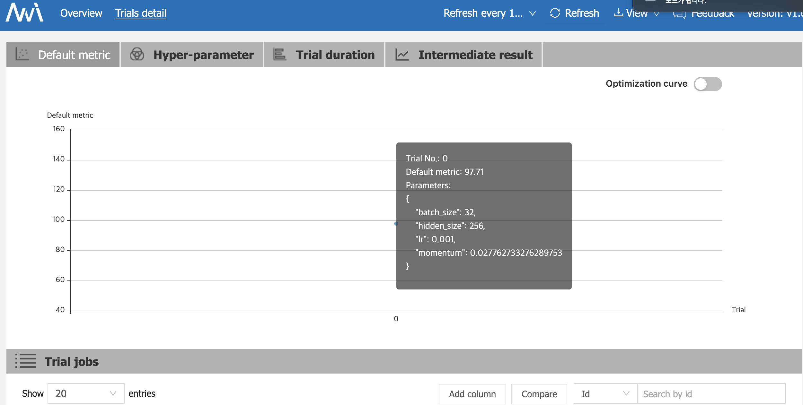

# Model_Serving
This Project is the reposiory for solving AI Engineer Party

## Architecture
<p align="center"></p>

## Procedure
- Download the data and upload it to bigquery.
- Load data and learn with AutoML.
- Store the learned weight in storage.
- Deploy the model. In this case, load the weight from storage and then inference.

## Dependencies
* [Python 3.6+](https://www.python.org/downloads/)
* [Pytorch 1.0+](https://pytorch.org/)
* [nni](https://github.com/microsoft/nni)(AutoML)
* [google-cloud-storage 1.18.0](https://cloud.google.com/products/storage/?hl=ko&utm_source=google&utm_medium=cpc&utm_campaign=japac-KR-all-ko-dr-bkws-all-super-trial-e-dr-1003987&utm_content=text-ad-none-none-DEV_c-CRE_249736096014-ADGP_Hybrid+%7C+AW+SEM+%7C+BKWS+~+T1+%7C+EXA+%7C+Storage+%7C+1:1+%7C+KR+%7C+ko+%7C+cloud+storage+%7C+google+storage+%7C+en-KWID_43700030027797723-kwd-2833008840&userloc_1009871&utm_term=KW_google%20storage&gclid=Cj0KCQjwqs3rBRCdARIsADe1pfSIWITyBlJz2NmEsJkUiTxNVmgexAXcWS3Man5-XZ7QlfjSQQb1UDAaAhcwEALw_wcB)
* [google-cloud-bigquery 1.18.0](https://cloud.google.com/bigquery/?hl=ko&utm_source=google&utm_medium=cpc&utm_campaign=japac-KR-all-ko-dr-bkws-all-super-trial-e-dr-1003987&utm_content=text-ad-none-none-DEV_c-CRE_263273142169-ADGP_Hybrid+%7C+AW+SEM+%7C+BKWS+~+T1+%7C+EXA+%7C+Big+Data+%7C+1:1+%7C+KR+%7C+ko+%7C+big+query+%7C+google+bigquery+%7C+en-KWID_43700030027797576-kwd-63326440124&userloc_1009871&utm_term=KW_google%20bigquery&gclid=Cj0KCQjwqs3rBRCdARIsADe1pfTmpa8viuebXAHYmpK815sGPjBcp6AJ5Wp8o8CRjjOSMEXwt3pnFZgaAvCxEALw_wcB)

 
 ## Quick Tutorial and Usage
 
 ### 1.set your GCE region. In my case `us central1` 
 ```shell
 $ gcloud config set compute/zone us-central1
 ```
 
 ### 2. install Google Cloud SDK
 ```shell
 $ https://cloud.google.com/sdk/docs/quickstarts
 ```
 
 ### 3. install google cloud python API
 ```shell
 $ pip install --upgrade google-cloud-storage
 $ pip install --upgrade google-cloud-bigquery
 ```
 
 ### 4. Download MNIST dataset
 ```shell
 $ tools/make_data.py
```

### 5. Upload on BigQuery
```shell
$ bq load --source_formag=CSV -F":" mnist.train data/train.txt.gz\
  "key:integer, image:string,label:integer"
$ bq load --source_formag=CSV -F":" mnist.test data/test.txt.gz\
  "key:integer, image:string,label:integer"
```

### 6. Check BirQuery python API operation
```python
from google.cloud import bigquery
client = bigquery.Client()
query = ("SELECT image, label FROM mnist.train")
query_job = client.query(
  query,
) #API request -starts the query
for row in query_job: # API request -fetches results
  print(row)
```

### 7. Install AutoML nni of Microsoft
```shell
pip install --upgrade nni
```
click here for details(https://github.com/microsoft/nni)

### 8. Training using AutoML
```shell
nnictl create --config config.yml
```
<p align="center"></p>

### 9. Create Google Storage Bucket to upload saved model state_dict 
```shell
$ PROJECT_ID = $(gcloud config list project --format "value(core.projcet)")
$ BUCKET="${PROJECT_ID}-ml"

#create bucker
$ gsutil mb -c regional -l us-central1 gs://${BUCKET}

#upload saved model
$ gsutil -m cp -R save_model/model_param.pth gs://${BUCKET}
```

### 10. Deploy google functions
```shell
$ cd gdeploy
$ gcloud beta functions deploy [function_name] --runtime python37 --trigger-http
```
### 11. Test API usgin 'curl'
click here for details about [curl](https://curl.haxx.se/)
```shell
$ curl -X  POST\
curl -X POST -H "Content-Type:application/json"  -d '{"url":"[image url]"}'
```

### Reference
- [nni AutoML](https://github.com/microsoft/nni)
- [google cloud platform](https://cloud.google.com/gcp/?hl=ko&utm_source=google&utm_medium=cpc&utm_campaign=japac-KR-all-ko-dr-bkws-all-super-trial-e-dr-1003987&utm_content=text-ad-none-none-DEV_c-CRE_249736095768-ADGP_Hybrid%20%7C%20AW%20SEM%20%7C%20BKWS%20~%20T1%20%7C%20EXA%20%7C%20General%20%7C%201:1%20%7C%20KR%20%7C%20ko%20%7C%20cloud%20platform%20%7C%20google%20cloud%20platform%20%7C%20en-KWID_43700030027797672-kwd-26415313501&userloc_1009871&utm_term=KW_google%20cloud%20platform&gclid=Cj0KCQjwqs3rBRCdARIsADe1pfTUBYryyxIz4elnIW-MaexvwpV-RHlOhODxME2Hid7kGJAYJJtvDPgaAj8dEALw_wcB)
- [Tae Hwan Jung repository](github.com/graykode/mnist-flow)

### Author
- Juntae Kim, Korea University [DAVIAN LAB](http://davian.korea.ac.kr/)


 
 
